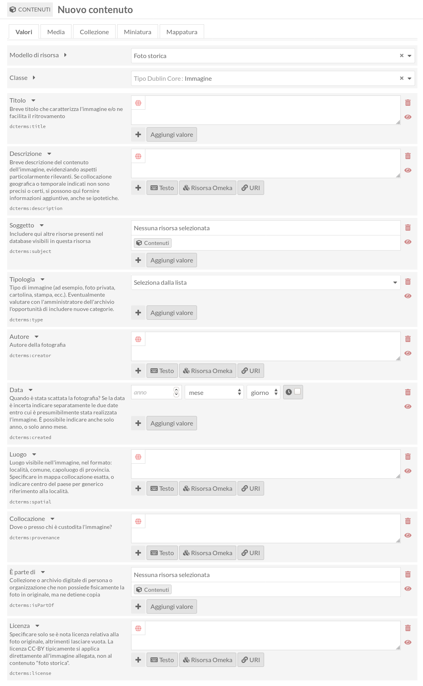

# Come caricare contenuti su Omeka

## Registrazione e login

L'amministratore dell'Archivio digitale dovrà creare un account per consentire l'accesso alla piattaforma per l'inserimento di nuovi contenuti. Non è infatti possibile, né generalmente auspicabile, la libera creazione di nuovi utenti.

Una volta in possesso delle credenziali per accedere alla piattaforma è possibile effettuare il login al seguente indirizzo:

https://archiviomemoria.ecomuseovalledeilaghi.it/login

## Aggiungere nuovi contenuti

Una volta effettuato il login, è possibile aggiungere nuovi contenuti cliccando sulla voce "Contenuti" del menu e poi sul pulsante "Aggiungi un nuovo contenuto" che appare in alto a destra. 

Apparirà a questo punto la schermata per l'inserimento di nuovi contenuti. 

Per prima cosa a questo punto bisogna scegliere quale tipo di contenuto stiamo per inserire, selezionando il "Modello di risorsa" appropriato. Questa scelta abiliterà i campi più rilevanti per il tipo di contenuto che andremo ad inserire, e farà comparire indicazioni rilevanti per ogni voce. 
 
Per chiarimenti sul significato di ognuno dei modelli di risorsa attualmente disponibili nell'Archivio digitale di Ecomuseo, consulta la sezione \@ref(tipologiacontenuti).

Non appena selezionato il modello di risorsa, la schermata di inserimento si aggiornerà di conseguenza. Questo ad esempio è ciò che apparirà selezionando "Nuova foto storica". 

Si prega di notare che per ogni campo sono incluse istruzioni relative allo specifico tipo di risorsa. 

Nella maggior parte dei casi, è sufficiente inserire il testo nel relativo campo ma è importante notare che alcuni campi hanno peculiarità. 

## Indicazioni generali

### Ripetere i campi

È sempre possibile ripetere più volte lo stesso campo. Ad esempio, se vi sono più autori di uno stesso contenuto non bisognerà scrivere i nomi uno in fila all'altro, ma inserirli separatamente utilizzando il pulsante "Aggiungi valore" presente sotto il relativo campo, o scegliendo il formato da inserire sotto il relativo campo (tipicamente, Testo).

In questo modo è possibile fornire varianti in più lingue per lo stesso campo, o semplicemente nomi diversi utilizzati per descrivere la stessa cosa.

## Come inserire informazioni in più lingue {#linguapratica}

Per inserire informazioni in più lingue è possibile ripetere i campi, specificando per ognuno la lingua cliccando sul piccolo globo in alto a sinistra del riquadro nell'interfaccia di inserimento.

Per incoraggiare l'utilizzo di soluzione standard, la piattaforma obbliga all'utilizzo dei [codici IETF](https://it.wikipedia.org/wiki/Codice_di_lingua_IETF), che solitamente coincidono con i diffusi codici di due lettere per le lingue contemporanee, ad esempio `it` per l'italiano, `en` per l'inglese, `de` per il tedesco, o `la` per il latino. Varianti locali, regionali, storiche, o impiego di alfabeti diversi, possono in alcuni casi essere espresse utilizzando definizioni standard. Per quanto ci è dato sapere, non esiste un codice standard già definito per il dialetto trentino, quindi per indicare contenuti in dialetto locale utilizzeremo il generico `it-trentino`.

All'interno della piattaforma per l'inserimento dati, la relativa sezione appare come segue:

Così appare invece a chi visita il sito:

Se vi sono più nomi per lo tesso oggetto, si raccomanda di aggiungere nuovi valori (ovvero, effettivamente ripetere il campo titolo), e non includere tutte le varianti separate da virgola o trattino. 

## Creare nuove collezioni {#collezionepratica}

__N.B.__ Tipicamente, chi aggiunge contenuti all'archivio non dovrà crerae nuove collezioni. Per evitarne l'inutile proliferazione, se nessuna delle collezioni attualmente disponibili pare adeguata al contenuto, si prega di valutare con chi coordina l'iniziativa l'utilità di aggiungere nuove collezioni.

Per creare una nuova collezione è sufficiente:

- selezionare "Collezione" dal menu di sinistra
- cliccare su "aggiungi una nuova collezione" dal link disponibile in alto a destra della schermata (in alternativa, [clicca direttamente su questo link per arrivare alla relativa schermata](https://archivioecomuseo.roxanatodea.com/admin/item-set/add))
- a fianco del campo "Modello di risorsa", selezionare "Collezione"
- completare il campo "Titolo" e "Descrizione" seguendo le indicazioni
- cliccare su "Salva" in alto a destra.

Per maggiori dettagli su che cosa è una "collezione", vedi in particolare la sezione \@ref(collezioneteoria). 